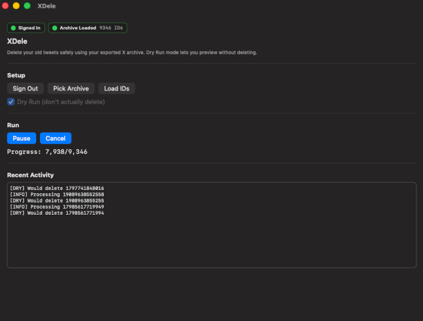
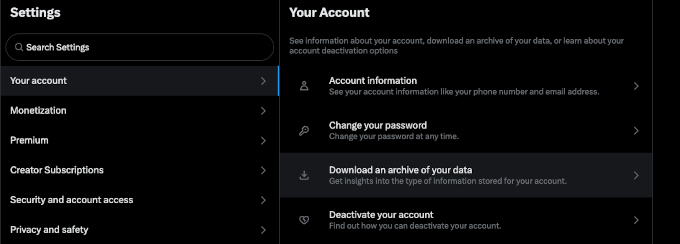

# XDele

**X (Twitter)** now enforces **paid API tiers** for all write and delete actions.  
Free (X developer) accounts receive "429 Too Many Requests" or "403 Forbidden" on the first delete attempt, effectively blocking bulk deletion through the official API.

XDele v2.0 remains available as a fully working **macOS SwiftUI app** for archive parsing, dry-run simulation, and credential testing.  
Actual deletion now only works for users with paid API access.

The original idea was that users could bulk-delete replies, posts, retweets, and likes using the free API. this is no longer possible with the free API.
Older versions have been removed. v2 source remains public under **AGPLv3** for anyone who wishes to fork, study, or adapt alternate deletion methods.

### [Download XDele App](https://github.com/yourusername/XDele/releases)
(v2.0 release - API limits and old versions removed)

## Requirements
- macOS 13.0 (Ventura) or newer  
- Internet connection (for OAuth2 sign-in)  
- An exported **X Archive** (unzipped, local folder)  
- A valid **X Developer account** (for OAuth2 login)  
- (Optional) Xcode 15 or later if building the source and not just running the app

---

## 1. Download Your X Archive
1. In X: **Settings & Privacy → Your account → Download an archive of your data**.
2. Wait for the email, download, and unzip the archive.
3. Inside you will find a data/ folder with files such as tweets.js and likes.js.

---

## 2. Authentication
When you first open XDele, press **“Sign In”**.  
A secure OAuth2 browser window will open - authenticate with your X developer account.  
Once authenticated, your tokens are securely stored in the **macOS Keychain** (never plaintext).

After signing in, you’ll see a **green indicator** next to “Signed In” in the UI.

---

## 3. Select and Load Your Archive

1. Click **“Pick Archive”** and choose the **unzipped archive folder** you downloaded earlier.  
2. The app will securely bookmark this folder for future sessions.  
3. Once selected, XDele will automatically scan and count all tweet IDs found inside.

You’ll see a summary in the log, such as [INFO] Loaded 1,000 IDs from archive.

---

## 4. Run (or Simulate) Deletion

- Enable **Dry Run** to simulate deletion without contacting the API.  
- Click **Start** to begin the process.  
- You can **Pause**, **Resume**, or **Cancel** at any time.

**Note:**  
Actual deletion via API only works for users with paid X API access. It will no longer succeed for free X API users.

---

## Developer Notes

XDele demonstrates:
- Full **OAuth2 PKCE** flow with "ASWebAuthenticationSession"
- Secure **Keychain token storage**
- **Security-scoped bookmarks** for sandboxed folder access
- SwiftUI-based async task orchestration
- Real-time **log streaming** with Pause/Resume/Cancel control 

---

## Troubleshooting
- **No deletions happening**: confirm your token is user-scoped with write permissions, and your user ID is correct.  
- **Nothing to do**: ensure the correct 'data/' folder is selected and filters aren’t too restrictive.  
- **Progress stuck**: queues may be empty. Clear X data, re-select the folder, and restart.  
- **macOS Gatekeeper warning**: right-click the app → **Open** to approve.
- If it keeps preventing you from opening the app you may have to go to Settings → Privacy & Security and specifically allow the app.

---

## License
You may redistribute and/or modify it under the terms of the AGPLv3 or later.  
See the [LICENSE](LICENSE) file for full details, or [https://www.gnu.org/licenses/agpl-3.0.html](https://www.gnu.org/licenses/agpl-3.0.html).  
